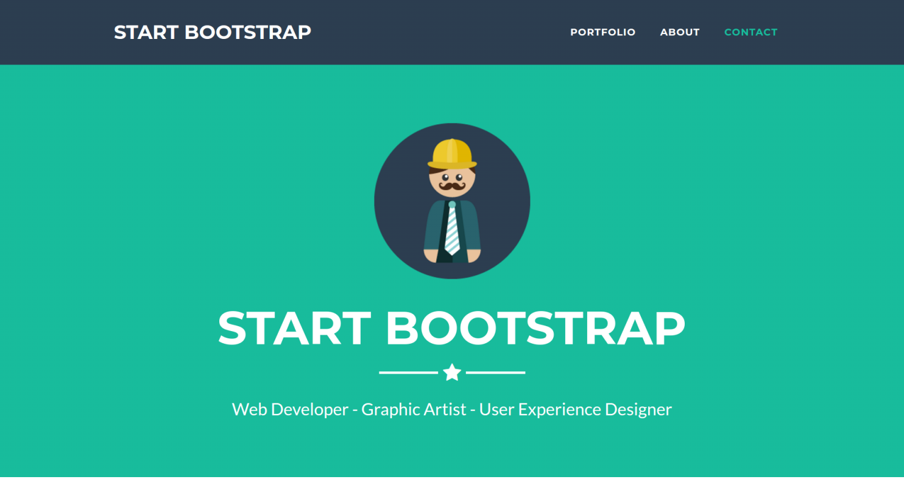
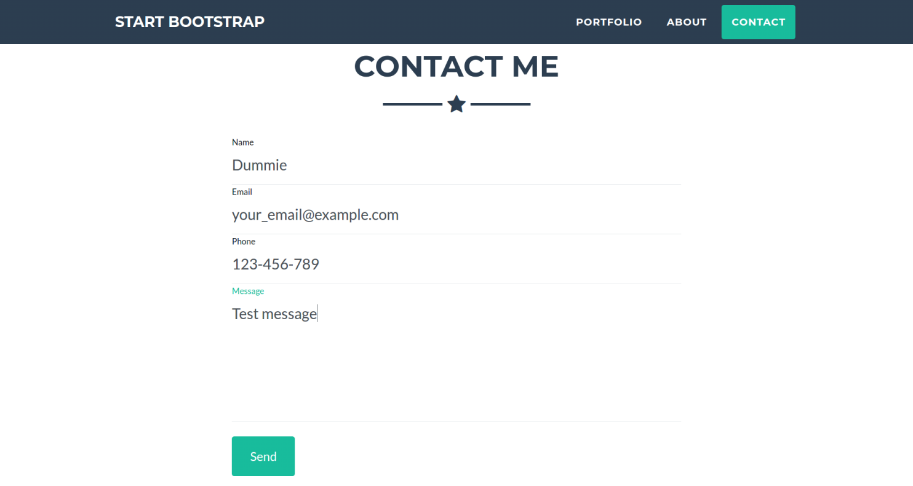

# Freelancer app

Added ability to send email and save info from the contact form to the database
Used this bootstrap theme https://github.com/BlackrockDigital/startbootstrap-freelancer

Demo: [Freelancer](https://freelancer-contact-form.herokuapp.com/)

---
### First, install all gems:

`bundle install`

### Second, setup database and migrations

`rails db:setup && rails db:migrate`

### Last, start the server

`rails server`

Go to http://localhost:3000
